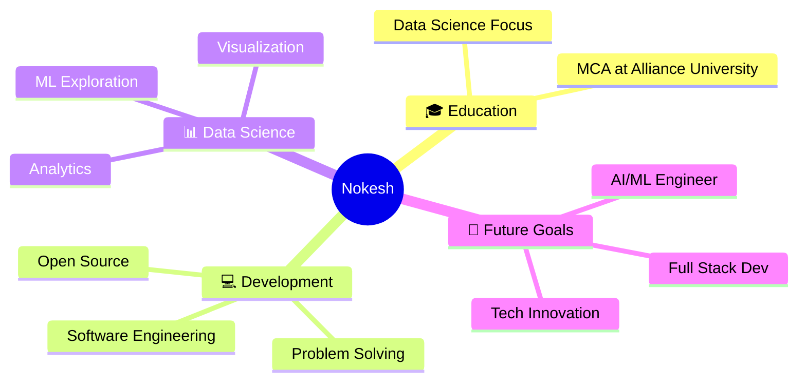

# 👋 Hello, I'm Nokesh Bellamkonda!

<div align="center">
  
</div>

<p align="center">
  
  
</p>

## 🚀 About Me

```python
class NokeshBellamkonda:
    def __init__(self):
        self.name = "Bellamkonda Nokesh"
        self.role = "MCA Student & Aspiring Software Engineer"
        self.university = "Alliance University"
        self.specialization = "Data Science"
        self.location = "India"
        self.current_focus = ["Data Science", "Software Development", "Problem Solving"]
        self.learning = ["Advanced Data Analytics", "Machine Learning", "Software Architecture"]
        
    def say_hi(self):
        print("Thanks for visiting! Let's connect and build something amazing together!")

me = NokeshBellamkonda()
me.say_hi()
```

<div align="center">
  
</div>

## 🌟 What I'm Up To



## 🛠️ Tech Arsenal

<div align="center">

### Programming Languages


### Data Science & Analytics


### Database & Tools


### Design & Creativity


</div>

## 📊 GitHub Analytics

<div align="center">
  
  
</div>

<div align="center">
  
</div>

## 🏆 Achievement Showcase

<div align="center">
  
</div>

## 📈 Contribution Graph

<div align="center">
  
</div>

## 🎯 Current Goals

- 🔭 **Working on:** Data Science projects and software development skills
- 🌱 **Learning:** Advanced machine learning algorithms and full-stack development
- 👯 **Looking to collaborate on:** Open source projects related to data science and web development
- 💬 **Ask me about:** Java, JavaScript, Data Analysis, or anything tech-related
- ⚡ **Fun fact:** I believe every dataset has a story to tell, and every bug is just an undiscovered feature!

## 🌐 Let's Connect

<div align="center">

[](https://www.linkedin.com/in/nokesh-bellamkonda-39b665249/)
[](https://www.hackerrank.com/profile/bellamkondanoke1)
[](https://leetcode.com/u/Bellamkonda_Nokesh/)

</div>

## 💭 Random Dev Wisdom

<div align="center">
  
</div>

## 📊 Weekly Development Breakdown

```text
Java         4 hrs 30 mins   ████████████████▒░░░   65.5%
Python       1 hr 45 mins    ██████▓░░░░░░░░░░░░░░   25.7%
JavaScript   25 mins         █▓░░░░░░░░░░░░░░░░░░░    6.2%
SQL          10 mins         ▒░░░░░░░░░░░░░░░░░░░░    2.6%
```

## 🚀 Featured Projects

<div align="center">
  <a href="https://github.com/Bellamkonda-Nokesh/your-project-1">
    
  </a>
  <a href="https://github.com/Bellamkonda-Nokesh/your-project-2">
    
  </a>
</div>

---

<div align="center">
  
</div>

<div align="center">
  <b>✨ "Code is poetry, data tells stories, and every bug is a lesson in disguise!" ✨</b>
  <br><br>
  
</div>
